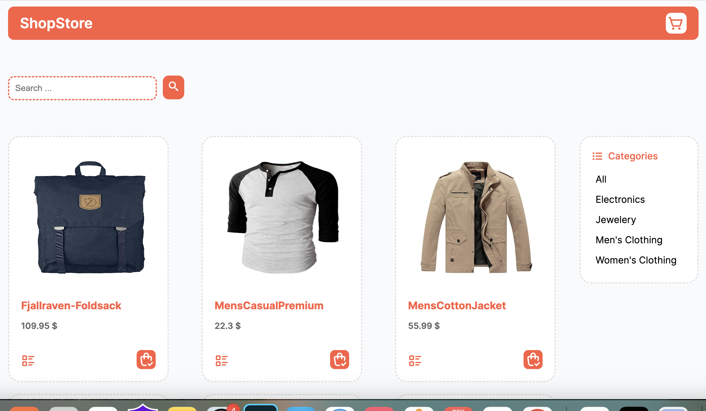

# ShopStore

A React.js project with SCSS styling, utilizing `useReducer` and `Context` for state management.

## Features

- **State Management**: Leveraging `useReducer` and `Context` for efficient state management.
- **Routing**: Utilizing `react-router-dom` version 6 for seamless navigation within the application.
- **API Integration**: Using Axios and React Query for efficient and effective API data fetching.

## Technologies Used

- **React.js**: A JavaScript library for building user interfaces.
- **SCSS**: A popular CSS preprocessor to enhance styling capabilities.
- **React Router DOM (v6)**: The standard library for navigation in React applications.
- **Axios**: A promise-based HTTP client for the browser and Node.js.
- **React Query**: A React library for fetching, caching, and updating asynchronous data.

## Getting Started

1. Clone the repository:

    ```bash
    git clone https://github.com/rezaansarirad/shopStore.git
    ```

2. Install dependencies:

    ```bash
    npm install
    ```

3. Run the project:

    ```bash
    npm start
    ```

## Screenshots




<!-- Add more screenshots if needed -->

## Contributing

Feel free to contribute to the project by opening issues or creating pull requests. Your feedback and suggestions are highly appreciated.

## License

This project is licensed under the [MIT License](LICENSE).
